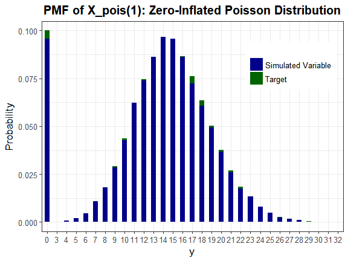
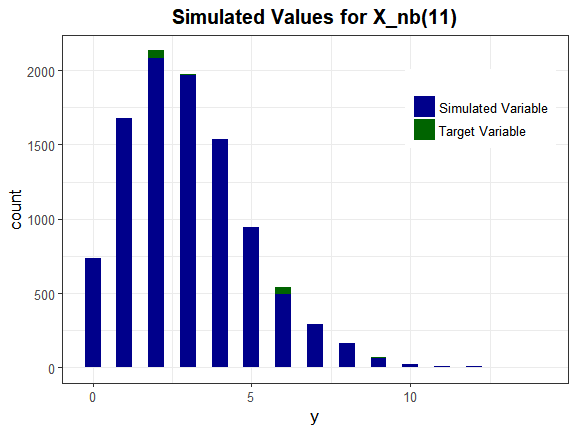

<!-- README.md is generated from README.Rmd. Please edit that file -->
SimRepeat
=========

The goal of **SimRepeat** is to generate correlated systems of statistical equations which represent **repeated measurements** or clustered data. These systems contain either: **a)** continuous normal, non-normal, and mixture variables based on the techniques of Headrick and Beasley (Headrick and Beasley 2004) or *b)* continuous (normal, non-normal and mixture), ordinal, and count (regular or zero-inflated, Poisson and Negative Binomial) variables based on the hierarchical linear models (HLM) approach. Headrick and Beasley's method for continuous variables calculates the beta (slope) coefficients based on the target correlations between independent variables and between outcomes and independent variables. The package provides functions to calculate the expected correlations between outcomes, between outcomes and error terms, and between outcomes and independent variables, extending Headrick and Beasley's equations to include mixture variables. These theoretical values can be compared to the simulated correlations. The HLM approach requires specification of the beta coefficients, but permits group and subject-level independent variables, interactions among independent variables, and fixed and random effects, providing more flexibility in the system of equations. Both methods permit simulation of data sets that mimic real-world clinical or genetic data sets (i.e. plasmodes, as in Vaughan et al. (2009)).

The techniques extend those found in the **SimMultiCorrData** (Fialkowski 2017) and **SimCorrMix** (Fialkowski 2018) packages. Standard normal variables with an imposed intermediate correlation matrix are transformed to generate the desired distributions. Continuous variables are simulated using either Fleishman's third-order (Fleishman 1978) or Headrick's fifth-order (Headrick 2002) power method transformation (PMT). Simulation occurs at the component-level for continuous mixture distributions. These components are transformed into the desired mixture variables using random multinomial variables based on the mixing probabilities. The target correlation matrices are specified in terms of correlations with components of continuous mixture variables. Binary and ordinal variables are simulated by discretizing the normal variables at quantiles defined by the marginal distributions. Count variables are simulated using the inverse CDF method.

There are two simulation pathways for the multi-variable type systems which differ by intermediate correlations involving count variables. Correlation Method 1 adapts Yahav and Shmueli's 2012 method (Yahav and Shmueli 2012) and performs best with large count variable means and positive correlations or small means and negative correlations. Correlation Method 2 adapts Barbiero and Ferrari's 2015 modification of the **GenOrd** package (A. Barbiero and Ferrari 2015; Ferrari and Barbiero 2012; Barbiero and Ferrari 2015) and performs best under the opposite scenarios. There are three methods available for correcting non-positive definite correlation matrices. The optional error loop may be used to improve the accuracy of the final correlation matrices. The package also provides function to check parameter inputs and summarize the generated systems of equations.

There are vignettes which accompany this package that may help the user understand the simulation and analysis methods.

1.  **Theory and Equations for Correlated Systems of Continuous Variables** describes the system of continuous variables generated with `nonnormsys` and derives the equations used in `calc_betas`, `calc_corr_y`, `calc_corr_ye`, and `calc_corr_yx`.

2.  **Correlated Systems of Statistical Equations with Non-Mixture and Mixture Continuous Variables** provides examples of using `nonnormsys`.

3.  **The Hierarchical Linear Models Approach for a System of Correlated Equations with Multiple Variable Types** describes the system of ordinal, continuous, and count variables generated with `corrsys` and `corrsys2`.

4.  **Correlated Systems of Statistical Equations with Multiple Variable Types** provides examples of using `corrsys` and `corrsys2`.

Installation instructions
-------------------------

**SimRepeat** can be installed using the following code:

``` r
## from GitHub
install.packages("devtools")
devtools::install_github("AFialkowski/SimRepeat", build_vignettes = TRUE)
```

Example 1: System of three equations for 5 independent variables with no random effects
---------------------------------------------------------------------------------------

### Description of Variables

1.  **Ordinal variable:** X\_ord(1) has 3 categories (i.e., drug treatment) and is the same in each equation
2.  **Continuous variables:**

<!-- -->

1.  X\_cont(1) is a time-varying covariate (subject-level term) with an AR(1, p = 0.5) correlation structure

<!-- -->

1.  X\_cont(11) has a Chisq(df = 2) distribution
2.  X\_cont(21) has a Chisq(df = 4) distribution
3.  X\_cont(31) has a Chisq(df = 8) distribution

<!-- -->

1.  X\_mix(1) is a normal mixture time-varying covariate (subject-level term), components have an AR(1, p = 0.4) correlation structure across Y

<!-- -->

1.  **Poisson variable:** X\_pois(1) is a zero-inflated Poisson variable with mean = 15, the probability of a structural zero set at 0.10, and is the same in each equation
2.  **Negative Binomial variable:** X\_nb(1) is a regular NB time-varying covariate (subject-level term) with an AR(1, p = 0.3) correlation structure and increasing mean and variance

<!-- -->

1.  X\_nb(11) has a size of 10 and mean of 3
2.  X\_nb(21) has a size of 10 and mean of 4
3.  X\_nb(31) has a size of 10 and mean of 5

<!-- -->

1.  **Error terms** have a Beta(4, 1.5) distribution with an AR(1, p = 0.4) correlation structure. These require a sixth cumulant correction of 0.03.

There is an interaction between X\_ord(1) and X\_pois(1) for each Y. Since they are both group-level covariates, the interaction is also a group-level covariate that will interact with the subject-level covariates X\_cont(1), X\_mix(1) and X\_nb(1). However, only X\_ord(1) and X\_pois(1) interact with time in this example. Normally their interaction would also interact with time. A description of this HLM model may be found in the package vignettes.

``` r
library("SimRepeat")
library("printr")
library("reshape2")
options(scipen = 999)
```

### Step 1: Set up parameter inputs

This is the most time-consuming part of the simulation process. It is important to read the function documentation carefully to understand the formats for each parameter input. Incorrect formatting will lead to errors. Most of these can be prevented by using the `checkpar` function in **Step 2**.

``` r
seed <- 126
n <- 10000
M <- 3

# Ordinal variable
marginal <- lapply(seq_len(M), function(x) list(c(1/3, 2/3)))
support <- lapply(seq_len(M), function(x) list(c(0, 1, 2)))

# Non-mixture continuous variables
method <- "Polynomial"
Stcum1 <- calc_theory("Chisq", 2)
Stcum2 <- calc_theory("Chisq", 4)
Stcum3 <- calc_theory("Chisq", 8)

# Error terms
error_type <- "non_mix"
Stcum4 <- calc_theory("Beta", c(4, 1.5))
corr.e <- matrix(c(1, 0.4, 0.4^2, 0.4, 1, 0.4, 0.4^2, 0.4, 1), M, M, 
  byrow = TRUE)

skews <- list(c(Stcum1[3], Stcum4[3]), c(Stcum2[3], Stcum4[3]), 
  c(Stcum3[3], Stcum4[3]))
skurts <- list(c(Stcum1[4], Stcum4[4]), c(Stcum2[4], Stcum4[4]), 
  c(Stcum3[4], Stcum4[4]))
fifths <- list(c(Stcum1[5], Stcum4[5]), c(Stcum2[5], Stcum4[5]), 
  c(Stcum3[5], Stcum4[5]))
sixths <- list(c(Stcum1[6], Stcum4[6]), c(Stcum2[6], Stcum4[6]), 
  c(Stcum3[6], Stcum4[6]))
Six <- lapply(seq_len(M), function(x) list(NULL, 0.03))

# Mixture continuous variable
mix_pis <- lapply(seq_len(M), function(x) list(c(0.4, 0.6)))
mix_mus <- lapply(seq_len(M), function(x) list(c(-2, 2)))
mix_sigmas <- lapply(seq_len(M), function(x) list(c(1, 1)))
mix_skews <- lapply(seq_len(M), function(x) list(c(0, 0)))
mix_skurts <- lapply(seq_len(M), function(x) list(c(0, 0)))
mix_fifths <- lapply(seq_len(M), function(x) list(c(0, 0)))
mix_sixths <- lapply(seq_len(M), function(x) list(c(0, 0)))
mix_Six <- list()
Nstcum <- calc_mixmoments(mix_pis[[1]][[1]], mix_mus[[1]][[1]], 
  mix_sigmas[[1]][[1]], mix_skews[[1]][[1]], mix_skurts[[1]][[1]], 
  mix_fifths[[1]][[1]], mix_sixths[[1]][[1]])

means <- list(c(Stcum1[1], Nstcum[1], 0),
              c(Stcum2[1], Nstcum[1], 0),
              c(Stcum3[1], Nstcum[1], 0))
vars <- list(c(Stcum1[2]^2, Nstcum[2]^2, Stcum4[2]^2),
             c(Stcum2[2]^2, Nstcum[2]^2, Stcum4[2]^2),
             c(Stcum3[2]^2, Nstcum[2]^2, Stcum4[2]^2))

# Poisson variable
lam <- list(15, 15, 15)
p_zip <- 0.10

# Negative Binomial variables
size <- list(10, 10, 10)
mu <- list(3, 4, 5)
prob <- list()
p_zinb <- 0

# X_ord(11) and X_pois(11) are the same across Y
same.var <- c(1, 5)

# set up X correlation matrix
corr.x <- list()
corr.x[[1]] <- list(matrix(0.4, 6, 6), matrix(0.35, 6, 6), matrix(0.25, 6, 6))
diag(corr.x[[1]][[1]]) <- 1
# set correlations between components of X_mix(11) to 0
corr.x[[1]][[1]][3:4, 3:4] <- diag(2)
# set correlations between time-varying covariates of Y1 and Y2
corr.x[[1]][[2]][2, 2] <- 0.5
corr.x[[1]][[2]][3:4, 3:4] <- matrix(0.4, 2, 2)
corr.x[[1]][[2]][6, 6] <- 0.3
# set correlations between time-varying covariates of Y1 and Y3
corr.x[[1]][[3]][2, 2] <- 0.5^2
corr.x[[1]][[3]][3:4, 3:4] <- matrix(0.4^2, 2, 2)
corr.x[[1]][[3]][6, 6] <- 0.3^2
# set correlations for the same variables equal across outcomes
corr.x[[1]][[2]][, same.var] <- corr.x[[1]][[3]][, same.var] <-
  corr.x[[1]][[1]][, same.var]

corr.x[[2]] <- list(t(corr.x[[1]][[2]]), matrix(0.35, 6, 6), 
  matrix(0.25, 6, 6))
diag(corr.x[[2]][[2]]) <- 1
# set correlations between components of X_mix(21) to 0
corr.x[[2]][[2]][3:4, 3:4] <- diag(2)
# set correlations between time-varying covariates of Y2 and Y3
corr.x[[2]][[3]][2, 2] <- 0.5
corr.x[[2]][[3]][3:4, 3:4] <- matrix(0.4, 2, 2)
corr.x[[2]][[3]][6, 6] <- 0.3
# set correlations for the same variables equal across outcomes
corr.x[[2]][[2]][same.var, ] <- corr.x[[1]][[2]][same.var, ]
corr.x[[2]][[2]][, same.var] <- corr.x[[2]][[3]][, same.var] <- 
  t(corr.x[[1]][[2]][same.var, ])
corr.x[[2]][[3]][same.var, ] <- corr.x[[1]][[3]][same.var, ]

corr.x[[3]] <- list(t(corr.x[[1]][[3]]), t(corr.x[[2]][[3]]), 
  matrix(0.3, 6, 6))
diag(corr.x[[3]][[3]]) <- 1
# set correlations between components of X_mix(31) to 0
corr.x[[3]][[3]][3:4, 3:4] <- diag(2)
# set correlations for the same variables equal across outcomes
corr.x[[3]][[3]][same.var, ] <- corr.x[[1]][[3]][same.var, ]
corr.x[[3]][[3]][, same.var] <- t(corr.x[[3]][[3]][same.var, ])

Time <- 1:M
betas.0 <- 0
betas.t <- 1
# use a list of length 1 so that betas are the same across Y
betas <- list(seq(0.5, 1.5, 0.25))
# interaction between ordinal and Poisson variable, becomes 
# another group-level variable
int.var <- matrix(c(1, 1, 4, 2, 1, 4, 3, 1, 4), 3, 3, byrow = TRUE)
betas.int <- list(0.5)
# continuous non-mixture, continuous mixture, and NB variables are 
# subject-level variables
subj.var <- matrix(c(1, 2, 1, 3, 1, 5, 2, 2, 2, 3, 2, 5, 3, 2, 3, 3, 3, 5), 
  nrow = 9, ncol = 2, byrow = TRUE)
# there are 3 subject-level variables and 3 group-level variables forming 
# 9 group-subject interactions
betas.subj <- list(seq(0.5, 0.5 + (9 - 1) * 0.1, 0.1))
# only ordinal and Poisson variable interact with time (excluding the 
# ordinal-Poisson interaction variable)
tint.var <- matrix(c(1, 1, 1, 4, 2, 1, 2, 4, 3, 1, 3, 4), 6, 2, byrow = TRUE)
betas.tint <- list(c(0.25, 0.5))
```

### Step 2: Check parameter inputs

``` r
checkpar(M, method, error_type, means, vars, skews, skurts, fifths, sixths, 
  Six, mix_pis, mix_mus, mix_sigmas, mix_skews, mix_skurts, mix_fifths, 
  mix_sixths, mix_Six, marginal, support, lam, p_zip, pois_eps = list(), 
  size, prob, mu, p_zinb, nb_eps = list(), corr.x, corr.yx = list(), corr.e, 
  same.var, subj.var, int.var, tint.var, betas.0, betas, betas.subj, betas.int, 
  betas.t, betas.tint, quiet = TRUE)
#> [1] TRUE
```

### Step 3: Generate system

Note that `use.nearPD = FALSE` and `adjgrad = FALSE` so that negative eigen-values will be replaced with `eigmin` (default 0) instead of using the nearest positive-definite matrix (found with Bates and Maechler (2017)'s `Matrix::nearPD` function by Higham (2002)'s algorithm) or the adjusted gradient updating method via `adj_grad` (Yin and Zhang 2013; Zhang and Yin Year not provided; Maree 2012).

``` r
Sys1 <- corrsys(n, M, Time, method, error_type, means, vars,
  skews, skurts, fifths, sixths, Six, mix_pis, mix_mus, mix_sigmas, mix_skews,
  mix_skurts, mix_fifths, mix_sixths, mix_Six, marginal, support, lam, p_zip,
  size, prob, mu, p_zinb, corr.x, corr.e, same.var, subj.var, int.var,
  tint.var, betas.0, betas, betas.subj, betas.int, betas.t, betas.tint,
  seed = seed, use.nearPD = FALSE, quiet = TRUE)
#> Total Simulation time: 0.269 minutes
```

``` r
knitr::kable(Sys1$constants[[1]], booktabs = TRUE, 
  caption = "PMT constants for Y_1")
```

|          c0|         c1|          c2|          c3|          c4|         c5|
|-----------:|----------:|-----------:|-----------:|-----------:|----------:|
|  -0.3077396|  0.8005605|   0.3187640|   0.0335001|  -0.0036748|  0.0001587|
|   0.0000000|  1.0000000|   0.0000000|   0.0000000|   0.0000000|  0.0000000|
|   0.0000000|  1.0000000|   0.0000000|   0.0000000|   0.0000000|  0.0000000|
|   0.1629657|  1.0899841|  -0.1873287|  -0.0449503|   0.0081210|  0.0014454|

``` r
Sys1$valid.pdf
#> [[1]]
#> [1] "TRUE" "TRUE" "TRUE" "TRUE"
#> 
#> [[2]]
#> [1] "TRUE" "TRUE" "TRUE" "TRUE"
#> 
#> [[3]]
#> [1] "TRUE" "TRUE" "TRUE" "TRUE"
```

### Step 4: Describe results

``` r
Sum1 <- summary_sys(Sys1$Y, Sys1$E, E_mix = NULL, Sys1$X, Sys1$X_all, M, 
  method, means, vars, skews, skurts, fifths, sixths, mix_pis, mix_mus, 
  mix_sigmas, mix_skews, mix_skurts, mix_fifths, mix_sixths, marginal, 
  support, lam, p_zip, size, prob, mu, p_zinb, corr.x, corr.e)
names(Sum1)
#>  [1] "cont_sum_y"   "rho.y"        "cont_sum_e"   "target_sum_e"
#>  [5] "rho.e"        "rho.ye"       "ord_sum_x"    "cont_sum_x"  
#>  [9] "target_sum_x" "sum_xall"     "mix_sum_x"    "target_mix_x"
#> [13] "pois_sum_x"   "nb_sum_x"     "rho.x"        "rho.xall"    
#> [17] "rho.yx"       "rho.yxall"    "maxerr"
```

``` r
knitr::kable(Sum1$cont_sum_y, digits = 3, booktabs = TRUE, 
  caption = "Simulated Distributions of Outcomes")
```

|     |  Outcome|      N|     Mean|       SD|   Median|       Min|       Max|   Skew|  Skurtosis|   Fifth|   Sixth|
|-----|--------:|------:|--------:|--------:|--------:|---------:|---------:|------:|----------:|-------:|-------:|
| Y1  |        1|  10000|  246.918|  266.564|  159.396|  -109.731|  2629.224|  1.916|      5.318|  19.638|  88.913|
| Y2  |        2|  10000|  337.357|  326.326|  238.730|  -110.941|  3104.254|  1.676|      3.841|  11.058|  39.062|
| Y3  |        3|  10000|  457.657|  397.096|  346.616|   -25.791|  3096.069|  1.419|      2.483|   4.456|   5.776|

``` r
knitr::kable(Sum1$target_sum_e, digits = 3, booktabs = TRUE, 
  caption = "Target Distributions of Error Terms")
```

|     |  Outcome|  Mean|     SD|    Skew|  Skurtosis|  Fifth|   Sixth|
|-----|--------:|-----:|------:|-------:|----------:|------:|-------:|
| E1  |        1|     0|  0.175|  -0.694|     -0.069|  1.828|  -3.379|
| E2  |        2|     0|  0.175|  -0.694|     -0.069|  1.828|  -3.379|
| E3  |        3|     0|  0.175|  -0.694|     -0.069|  1.828|  -3.379|

``` r
knitr::kable(Sum1$cont_sum_e, digits = 3, booktabs = TRUE, 
  caption = "Simulated Distributions of Error Terms")
```

|     |  Outcome|      N|  Mean|     SD|  Median|     Min|    Max|    Skew|  Skurtosis|  Fifth|   Sixth|
|-----|--------:|------:|-----:|------:|-------:|-------:|------:|-------:|----------:|------:|-------:|
| E1  |        1|  10000|     0|  0.174|   0.027|  -0.643|  0.389|  -0.683|     -0.089|  1.780|  -3.071|
| E2  |        2|  10000|     0|  0.174|   0.028|  -0.646|  0.375|  -0.698|     -0.032|  1.704|  -3.365|
| E3  |        3|  10000|     0|  0.175|   0.028|  -0.636|  0.299|  -0.706|     -0.092|  2.032|  -3.845|

``` r
knitr::kable(Sum1$target_sum_x, digits = 3, booktabs = TRUE, 
  caption = "Target Distributions of Continuous Non-Mixture and Components of 
  Mixture Variables")
```

|          |  Outcome|    X|  Mean|     SD|   Skew|  Skurtosis|   Fifth|  Sixth|
|----------|--------:|----:|-----:|------:|------:|----------:|-------:|------:|
| cont1\_1 |        1|    1|     2|  2.000|  2.000|        6.0|  24.000|  120.0|
| cont1\_2 |        1|    2|    -2|  1.000|  0.000|        0.0|   0.000|    0.0|
| cont1\_3 |        1|    3|     2|  1.000|  0.000|        0.0|   0.000|    0.0|
| cont2\_1 |        2|    1|     4|  2.828|  1.414|        3.0|   8.485|   30.0|
| cont2\_2 |        2|    2|    -2|  1.000|  0.000|        0.0|   0.000|    0.0|
| cont2\_3 |        2|    3|     2|  1.000|  0.000|        0.0|   0.000|    0.0|
| cont3\_1 |        3|    1|     8|  4.000|  1.000|        1.5|   3.000|    7.5|
| cont3\_2 |        3|    2|    -2|  1.000|  0.000|        0.0|   0.000|    0.0|
| cont3\_3 |        3|    3|     2|  1.000|  0.000|        0.0|   0.000|    0.0|

``` r
knitr::kable(Sum1$cont_sum_x, digits = 3, booktabs = TRUE, 
  caption = "Simulated Distributions of Continuous Non-Mixture and Components 
  of Mixture Variables")
```

|          |  Outcome|    X|      N|    Mean|     SD|  Median|     Min|     Max|    Skew|  Skurtosis|   Fifth|    Sixth|
|----------|--------:|----:|------:|-------:|------:|-------:|-------:|-------:|-------:|----------:|-------:|--------:|
| cont1\_1 |        1|    1|  10000|   2.004|  2.037|   1.376|  -0.448|  21.396|   2.067|      6.262|  24.655|  118.059|
| cont1\_2 |        1|    2|  10000|  -2.000|  1.001|  -1.998|  -5.736|   1.813|   0.009|      0.028|  -0.097|   -0.326|
| cont1\_3 |        1|    3|  10000|   2.000|  1.001|   1.996|  -2.759|   6.091|  -0.005|      0.042|  -0.215|    0.721|
| cont2\_1 |        2|    1|  10000|   4.001|  2.842|   3.349|  -0.274|  25.813|   1.427|      3.031|   8.367|   26.853|
| cont2\_2 |        2|    2|  10000|  -2.000|  1.002|  -1.996|  -5.927|   2.091|   0.019|     -0.003|   0.146|    0.324|
| cont2\_3 |        2|    3|  10000|   2.000|  1.002|   2.008|  -1.891|   6.096|  -0.013|     -0.045|   0.043|    0.265|
| cont3\_1 |        3|    1|  10000|   7.999|  3.994|   7.389|   0.272|  36.025|   1.016|      1.637|   3.531|    8.915|
| cont3\_2 |        3|    2|  10000|  -2.000|  1.001|  -1.997|  -6.062|   1.377|  -0.008|     -0.025|  -0.006|   -0.212|
| cont3\_3 |        3|    3|  10000|   2.000|  1.001|   1.996|  -1.830|   5.986|   0.017|      0.075|  -0.027|   -0.201|

``` r
knitr::kable(Sum1$target_mix_x, digits = 3, booktabs = TRUE, 
  caption = "Target Distributions of Continuous Mixture Variables")
```

|         |  Outcome|    X|  Mean|   SD|    Skew|  Skurtosis|  Fifth|  Sixth|
|---------|--------:|----:|-----:|----:|-------:|----------:|------:|------:|
| mix1\_1 |        1|    1|   0.4|  2.2|  -0.289|     -1.154|  1.793|  6.173|
| mix2\_1 |        2|    1|   0.4|  2.2|  -0.289|     -1.154|  1.793|  6.173|
| mix3\_1 |        3|    1|   0.4|  2.2|  -0.289|     -1.154|  1.793|  6.173|

``` r
knitr::kable(Sum1$mix_sum_x, digits = 3, booktabs = TRUE, 
  caption = "Simulated Distributions of Continuous Mixture Variables")
```

|         |  Outcome|    X|      N|  Mean|   SD|  Median|     Min|    Max|    Skew|  Skurtosis|  Fifth|  Sixth|
|---------|--------:|----:|------:|-----:|----:|-------:|-------:|------:|-------:|----------:|------:|------:|
| mix1\_1 |        1|    1|  10000|   0.4|  2.2|   1.052|  -5.613|  5.759|  -0.293|     -1.140|  1.814|  6.011|
| mix2\_1 |        2|    1|  10000|   0.4|  2.2|   1.032|  -5.580|  5.586|  -0.304|     -1.152|  1.869|  6.045|
| mix3\_1 |        3|    1|  10000|   0.4|  2.2|   1.038|  -6.119|  6.015|  -0.279|     -1.154|  1.747|  6.235|

``` r
Nplot <- plot_simpdf_theory(sim_y = Sys1$X_all[[1]][, 3], ylower = -10, 
  yupper = 10, 
  title = "PDF of X_mix(11): Mixture of Normal Distributions",
  fx = function(x) mix_pis[[1]][[1]][1] * dnorm(x, mix_mus[[1]][[1]][1], 
    mix_sigmas[[1]][[1]][1]) + mix_pis[[1]][[1]][2] * 
    dnorm(x, mix_mus[[1]][[1]][2], mix_sigmas[[1]][[1]][2]), 
  lower = -Inf, upper = Inf)
Nplot
```


Summary of Ordinal Variable: (for Y\_1)

``` r
knitr::kable(Sum1$ord_sum_x[[1]][1:2, ], digits = 3, row.names = FALSE,
             booktabs = TRUE, caption = "Simulated Distribution of X_ord(1)")
```

|  Outcome|  Support|  Target|  Simulated|
|--------:|--------:|-------:|----------:|
|        1|        0|   0.333|       0.33|
|        1|        1|   0.667|       0.67|

Summary of Poisson Variable:

``` r
knitr::kable(Sum1$pois_sum_x, digits = 3, row.names = FALSE,
             booktabs = TRUE, caption = "Simulated Distribution of X_pois(1)")
```

|  Outcome|    X|      N|     P0|  Exp\_P0|   Mean|  Exp\_Mean|     Var|  Exp\_Var|  Median|  Min|  Max|    Skew|  Skurtosis|
|--------:|----:|------:|------:|--------:|------:|----------:|-------:|---------:|-------:|----:|----:|-------:|----------:|
|        1|    1|  10000|  0.096|      0.1|  13.53|       13.5|  33.195|        40|      14|    0|   32|  -0.832|      0.755|
|        2|    1|  10000|  0.096|      0.1|  13.53|       13.5|  33.195|        40|      14|    0|   32|  -0.832|      0.755|
|        3|    1|  10000|  0.096|      0.1|  13.53|       13.5|  33.195|        40|      14|    0|   32|  -0.832|      0.755|

``` r
Pplot <- plot_simpdf_theory(sim_y = Sys1$X_all[[1]][, 4], 
  title = "PMF of X_pois(1): Zero-Inflated Poisson Distribution", 
  Dist = "Poisson", params = c(lam[[1]][1], p_zip), cont_var = FALSE)
Pplot
```



Summary of Negative Binomial Variables X\_nb(11), X\_nb(21), and X\_nb(31):

``` r
knitr::kable(Sum1$nb_sum_x, digits = 3, row.names = FALSE,
             booktabs = TRUE, caption = "Simulated Distributions")
```

|  Outcome|    X|      N|     P0|  Exp\_P0|   Prob|   Mean|  Exp\_Mean|    Var|  Exp\_Var|  Median|  Min|  Max|   Skew|  Skurtosis|
|--------:|----:|------:|------:|--------:|------:|------:|----------:|------:|---------:|-------:|----:|----:|------:|----------:|
|        1|    1|  10000|  0.074|    0.073|  0.769|  2.999|          3|  3.923|       3.9|       3|    0|   14|  0.840|      1.026|
|        2|    1|  10000|  0.036|    0.035|  0.714|  4.002|          4|  5.592|       5.6|       4|    0|   18|  0.762|      0.838|
|        3|    1|  10000|  0.016|    0.017|  0.667|  5.001|          5|  7.550|       7.5|       5|    0|   21|  0.768|      0.885|

``` r
NBplot <- plot_simtheory(sim_y = Sys1$X_all[[1]][, 5], 
  title = "Simulated Values for X_nb(11)", Dist = "Negative_Binomial", 
  params = c(size[[1]][1], mu[[1]][1], p_zinb), cont_var = FALSE, 
  binwidth = 0.5)
NBplot
```



Maximum Correlation Errors for X Variables by Outcome:

``` r
maxerr <- do.call(rbind, Sum1$maxerr)
rownames(maxerr) <- colnames(maxerr) <- paste("Y", 1:M, sep = "")
knitr::kable(as.data.frame(maxerr), digits = 5, booktabs = TRUE, 
  caption = "Maximum Correlation Errors for X Variables")
```

|     |       Y1|       Y2|       Y3|
|-----|--------:|--------:|--------:|
| Y1  |  0.02037|  0.01822|  0.01582|
| Y2  |  0.01822|  0.00754|  0.00773|
| Y3  |  0.01582|  0.00773|  0.00773|

### Linear model

A linear model will be fit to the data using `glm` in order to see if the slope coefficients can be recovered (R Core Team 2017). First, the data is reshaped into long format using `reshape2::melt` (Wickham 2007). Note that since X\_ord(1) and X\_pois(1) are the same for each outcome, they will be used as factors (`id.vars`) and are only needed once.

``` r
data1 <- as.data.frame(cbind(factor(1:n), Sys1$Y, Sys1$X_all[[1]][, 1:5],
  Sys1$X_all[[2]][, c(2, 3, 5)], Sys1$X_all[[3]][, c(2, 3, 5)]))
colnames(data1)[1] <- "Subject"
data1.a <- melt(data1[, c("Subject", "ord1_1", "pois1_1", "Y1", "Y2", "Y3")], 
  id.vars = c("Subject", "ord1_1", "pois1_1"),
  measure.vars = c("Y1", "Y2", "Y3"), variable.name = "Time", value.name = "Y")
data1.b <- melt(data1[, c("Subject", "cont1_1", "cont2_1", "cont3_1")],
  id.vars = c("Subject"), variable.name = "Time", value.name = "cont1")
data1.c <- melt(data1[, c("Subject", "mix1_1", "mix2_1", "mix3_1")],
  id.vars = c("Subject"), variable.name = "Time", value.name = "mix1")
data1.d <- melt(data1[, c("Subject", "nb1_1", "nb2_1", "nb3_1")],
  id.vars = c("Subject"), variable.name = "Time", value.name = "nb1")
data1.a$Time <- data1.b$Time <- data1.c$Time <- data1.d$Time <- 
  c(rep(1, n), rep(2, n), rep(3, n))
data1 <- merge(merge(merge(data1.a, data1.b, by = c("Subject", "Time")), 
  data1.c, by = c("Subject", "Time")), data1.d, by = c("Subject", "Time"))
```

Errors E\_1, E\_2, and E\_3 modeled as having Normal distributions:

``` r
fm1 <- glm(Y ~ ord1_1 + cont1 + mix1 + pois1_1 + nb1 + ord1_1:pois1_1 + 
  ord1_1:cont1 + pois1_1:cont1 + ord1_1:pois1_1:cont1 + 
  ord1_1:mix1 + pois1_1:mix1 + ord1_1:pois1_1:mix1 + 
  ord1_1:nb1 + pois1_1:nb1 + ord1_1:pois1_1:nb1 + 
  Time + ord1_1:Time + pois1_1:Time, data = data1)
summary(fm1)
#> 
#> Call:
#> glm(formula = Y ~ ord1_1 + cont1 + mix1 + pois1_1 + nb1 + ord1_1:pois1_1 + 
#>     ord1_1:cont1 + pois1_1:cont1 + ord1_1:pois1_1:cont1 + ord1_1:mix1 + 
#>     pois1_1:mix1 + ord1_1:pois1_1:mix1 + ord1_1:nb1 + pois1_1:nb1 + 
#>     ord1_1:pois1_1:nb1 + Time + ord1_1:Time + pois1_1:Time, data = data1)
#> 
#> Deviance Residuals: 
#>      Min        1Q    Median        3Q       Max  
#> -0.64688  -0.11240   0.02727   0.14068   0.39024  
#> 
#> Coefficients:
#>                        Estimate Std. Error   t value            Pr(>|t|)
#> (Intercept)          0.00287060 0.00823869     0.348               0.728
#> ord1_1               0.49766237 0.00703858    70.705 <0.0000000000000002
#> cont1                0.75063243 0.00142573   526.491 <0.0000000000000002
#> mix1                 0.99906856 0.00154713   645.757 <0.0000000000000002
#> pois1_1              1.24992374 0.00062961  1985.228 <0.0000000000000002
#> nb1                  1.49970567 0.00185509   808.429 <0.0000000000000002
#> Time                 0.99819677 0.00437394   228.215 <0.0000000000000002
#> ord1_1:pois1_1       0.50005949 0.00043254  1156.090 <0.0000000000000002
#> ord1_1:cont1         0.50083525 0.00109047   459.283 <0.0000000000000002
#> cont1:pois1_1        0.59996344 0.00010283  5834.761 <0.0000000000000002
#> ord1_1:mix1          0.79926400 0.00154243   518.184 <0.0000000000000002
#> mix1:pois1_1         0.90001588 0.00012147  7409.542 <0.0000000000000002
#> ord1_1:nb1           1.09984748 0.00159766   688.411 <0.0000000000000002
#> pois1_1:nb1          1.19996403 0.00013694  8762.757 <0.0000000000000002
#> ord1_1:Time          0.24935535 0.00219772   113.461 <0.0000000000000002
#> pois1_1:Time         0.50015331 0.00030989  1613.978 <0.0000000000000002
#> ord1_1:cont1:pois1_1 0.69995266 0.00006723 10411.952 <0.0000000000000002
#> ord1_1:mix1:pois1_1  1.00005874 0.00010152  9851.192 <0.0000000000000002
#> ord1_1:pois1_1:nb1   1.30004792 0.00010218 12722.920 <0.0000000000000002
#>                         
#> (Intercept)             
#> ord1_1               ***
#> cont1                ***
#> mix1                 ***
#> pois1_1              ***
#> nb1                  ***
#> Time                 ***
#> ord1_1:pois1_1       ***
#> ord1_1:cont1         ***
#> cont1:pois1_1        ***
#> ord1_1:mix1          ***
#> mix1:pois1_1         ***
#> ord1_1:nb1           ***
#> pois1_1:nb1          ***
#> ord1_1:Time          ***
#> pois1_1:Time         ***
#> ord1_1:cont1:pois1_1 ***
#> ord1_1:mix1:pois1_1  ***
#> ord1_1:pois1_1:nb1   ***
#> ---
#> Signif. codes:  0 '***' 0.001 '**' 0.01 '*' 0.05 '.' 0.1 ' ' 1
#> 
#> (Dispersion parameter for gaussian family taken to be 0.03054669)
#> 
#>     Null deviance: 3575843856.20  on 29999  degrees of freedom
#> Residual deviance:        915.82  on 29981  degrees of freedom
#> AIC: -19498
#> 
#> Number of Fisher Scoring iterations: 2
```

Each effect in the model was found to be statistically significant at the alpha = 0.001 level. Now, compare betas used in simulation to those returned by `glm`:

``` r
fm1.coef <- fm1$coefficients[c("(Intercept)", "ord1_1", "cont1", "mix1", 
  "pois1_1", "nb1", "ord1_1:pois1_1", "Time", "ord1_1:cont1", "cont1:pois1_1", 
  "ord1_1:cont1:pois1_1", "ord1_1:mix1", "mix1:pois1_1", 
  "ord1_1:mix1:pois1_1", "ord1_1:nb1", "pois1_1:nb1", 
  "ord1_1:pois1_1:nb1", "ord1_1:Time", "pois1_1:Time")]
coef <- rbind(c(betas.0, betas[[1]], betas.int[[1]], betas.t, 
  betas.subj[[1]], betas.tint[[1]]), fm1.coef)
colnames(coef) <- names(fm1.coef)
rownames(coef) <- c("Simulated", "Estimated")
knitr::kable(as.data.frame(coef[, 1:6]), digits = 3, booktabs = TRUE, 
  caption = "Beta Coefficients for Repeated Measures Model 1")
```

|           |  (Intercept)|  ord1\_1|  cont1|   mix1|  pois1\_1|  nb1|
|-----------|------------:|--------:|------:|------:|---------:|----:|
| Simulated |        0.000|    0.500|  0.750|  1.000|      1.25|  1.5|
| Estimated |        0.003|    0.498|  0.751|  0.999|      1.25|  1.5|

``` r
knitr::kable(as.data.frame(coef[, 7:12]), digits = 3, booktabs = TRUE)
```

|           |  ord1\_1:pois1\_1|   Time|  ord1\_1:cont1|  cont1:pois1\_1|  ord1\_1:cont1:pois1\_1|  ord1\_1:mix1|
|-----------|-----------------:|------:|--------------:|---------------:|-----------------------:|-------------:|
| Simulated |               0.5|  1.000|          0.500|             0.6|                     0.7|         0.800|
| Estimated |               0.5|  0.998|          0.501|             0.6|                     0.7|         0.799|

``` r
knitr::kable(as.data.frame(coef[, 13:19]), digits = 3, booktabs = TRUE)
```

|           |  mix1:pois1\_1|  ord1\_1:mix1:pois1\_1|  ord1\_1:nb1|  pois1\_1:nb1|  ord1\_1:pois1\_1:nb1|  ord1\_1:Time|  pois1\_1:Time|
|-----------|--------------:|----------------------:|------------:|-------------:|---------------------:|-------------:|--------------:|
| Simulated |            0.9|                      1|          1.1|           1.2|                   1.3|         0.250|            0.5|
| Estimated |            0.9|                      1|          1.1|           1.2|                   1.3|         0.249|            0.5|

All of the slope coefficients are estimated well.

Example 2: System with 4 equations plus random intercept and random slope for time
----------------------------------------------------------------------------------

### Description of Variables

1.  Ordinal variable *X*<sub>*O*1</sub>, where Pr\[*X*<sub>*O*1</sub> = 0\]=0.2, Pr\[*X*<sub>*O*1</sub> = 1\]=0.35, and Pr\[*X*<sub>*O*1</sub> = 2\]=0.45, is a group-level variable and is static across equations.
2.  Continuous non-mixture variable *X*<sub>*C*1</sub> is a subject-level variable with a Logistic(0, 1) distribution, which requires a sixth cumulant correction of 1.75.
3.  *X* terms are correlated at 0.1 within an equation and have an AR(1) structure across equations. The correlations for the static variable are held constant across equations.
4.  Random intercept *U*<sub>0</sub> and time slope *U*<sub>1</sub> with Normal(0, 1) distributions. Correlation between random effects is 0.3.
5.  The error terms have *t*(10) distributions (mean 0, variance 1) and an AR(1, 0.4) correlation structure.

In this example, the random intercept and time slope have continuous non-mixture distributions for all Y. However, the functions `corrsys` and `corrsys2` permit a combination of none, non-mixture, and mixture distributions across the Y (i.e., if `rand.int = c("non_mix", "mix", "none")` then the random intercept for Y\_1 has a non-mixture, and the random intercept for Y\_2 has a mixture distribution; there is no random intercept for Y\_3). In addition, the distributions themselves can vary across outcomes. This is also true for random effects assigned to independent variables as specified in `rand.var`.

### Step 1: Set up parameter inputs

``` r
seed <- 1
n <- 10000
M <- 4

# Binary variable
marginal <- lapply(seq_len(M), function(x) list(c(0.2, 0.55)))
support <- lapply(seq_len(M), function(x) list(0:2))

same.var <- 1
subj.var <- matrix(c(1, 2, 2, 2, 3, 2, 4, 2), 4, 2, byrow = TRUE)

# create list of X correlation matrices
corr.x <- list()

rho1 <- 0.1
rho2 <- 0.5
rho3 <- rho2^2
rho4 <- rho2^3
# Y_1
corr.x[[1]] <- list(matrix(rho1, 2, 2), matrix(rho2, 2, 2), matrix(rho3, 2, 2),
  matrix(rho4, 2, 2))
diag(corr.x[[1]][[1]]) <- 1
# set correlations for the same variables equal across outcomes
corr.x[[1]][[2]][, same.var] <- corr.x[[1]][[3]][, same.var] <-
  corr.x[[1]][[4]][, same.var] <- corr.x[[1]][[1]][, same.var]

# Y_2
corr.x[[2]] <- list(t(corr.x[[1]][[2]]), matrix(rho1, 2, 2),
  matrix(rho2, 2, 2), matrix(rho3, 2, 2))
diag(corr.x[[2]][[2]]) <- 1
# set correlations for the same variables equal across outcomes
corr.x[[2]][[2]][same.var, ] <- corr.x[[1]][[2]][same.var, ]
corr.x[[2]][[2]][, same.var] <- corr.x[[2]][[3]][, same.var] <-
  corr.x[[2]][[4]][, same.var] <- t(corr.x[[1]][[2]][same.var, ])
corr.x[[2]][[3]][same.var, ] <- corr.x[[1]][[3]][same.var, ]
corr.x[[2]][[4]][same.var, ] <- corr.x[[1]][[4]][same.var, ]

# Y_3
corr.x[[3]] <- list(t(corr.x[[1]][[3]]), t(corr.x[[2]][[3]]),
  matrix(rho1, 2, 2), matrix(rho2, 2, 2))
diag(corr.x[[3]][[3]]) <- 1
# set correlations for the same variables equal across outcomes
corr.x[[3]][[3]][same.var, ] <- corr.x[[1]][[3]][same.var, ]
corr.x[[3]][[3]][, same.var] <- t(corr.x[[3]][[3]][same.var, ])
corr.x[[3]][[4]][same.var, ] <- corr.x[[1]][[4]][same.var, ]
corr.x[[3]][[4]][, same.var] <- t(corr.x[[1]][[3]][same.var, ])

# Y_4
corr.x[[4]] <- list(t(corr.x[[1]][[4]]), t(corr.x[[2]][[4]]),
  t(corr.x[[3]][[4]]), matrix(rho1, 2, 2))
diag(corr.x[[4]][[4]]) <- 1
# set correlations for the same variables equal across outcomes
corr.x[[4]][[4]][same.var, ] <- corr.x[[1]][[4]][same.var, ]
corr.x[[4]][[4]][, same.var] <- t(corr.x[[4]][[4]][same.var, ])

# create error term correlation matrix
corr.e <- matrix(c(1, 0.4, 0.4^2, 0.4^3,
                   0.4, 1, 0.4, 0.4^2,
                   0.4^2, 0.4, 1, 0.4,
                   0.4^3, 0.4^2, 0.4, 1), M, M, byrow = TRUE)

Log <- calc_theory("Logistic", c(0, 1))
t10 <- calc_theory("t", 10)

# Continuous variables: 1st non-mixture, 2nd error terms
means <- lapply(seq_len(M), function(x) c(Log[1], 0))
vars <- lapply(seq_len(M), function(x) c(Log[2]^2, 1))
skews <- lapply(seq_len(M), function(x) c(Log[3], t10[3]))
skurts <- lapply(seq_len(M), function(x) c(Log[4], t10[4]))
fifths <- lapply(seq_len(M), function(x) c(Log[5], t10[5]))
sixths <- lapply(seq_len(M), function(x) c(Log[6], t10[6]))
Six <- lapply(seq_len(M), function(x) list(1.75, NULL))

## RANDOM EFFECTS
rand.int <- "non_mix" # random intercept
rand.tsl <- "non_mix" # random time slope
rand.var <- NULL # no additional random effects

rmeans <- rskews <- rskurts <- rfifths <- rsixths <- c(0, 0)
rvars <- c(1, 1)
rSix <- list(NULL, NULL)

# append parameters for random effect distributions to parameters for
# continuous fixed effects and error terms
means <- append(means, list(rmeans))
vars <- append(vars, list(rvars))
skews <- append(skews, list(rskews))
skurts <- append(skurts, list(rskurts))
fifths <- append(fifths, list(rfifths))
sixths <- append(sixths, list(rsixths))
Six <- append(Six, list(rSix))

# use a list of length 1 so that betas are the same across Y
betas <- list(c(1, 1))
betas.subj <- list(0.5)
betas.tint <- list(0.75)

# set up correlation matrix for random effects
corr.u <- matrix(c(1, 0.3, 0.3, 1), 2, 2)
```

### Step 2: Check parameter inputs

``` r
checkpar(M, "Polynomial", "non_mix", means, vars, skews, skurts, fifths,
  sixths, Six, marginal = marginal, support = support, corr.x = corr.x,
  corr.e = corr.e, same.var = same.var, subj.var = subj.var, betas = betas,
  betas.subj = betas.subj, betas.tint = betas.tint, rand.int = rand.int,
  rand.tsl = rand.tsl, corr.u = corr.u, quiet = TRUE)
#> [1] TRUE
```

### Step 3: Generate system

``` r
Sys3 <- corrsys(n, M, Time = NULL, "Polynomial", "non_mix", means, vars,
  skews, skurts, fifths, sixths, Six, marginal = marginal, support = support,
  corr.x = corr.x, corr.e = corr.e, same.var = same.var, subj.var = subj.var,
  betas = betas, betas.subj = betas.subj, betas.tint = betas.tint,
  rand.int = rand.int, rand.tsl = rand.tsl, corr.u = corr.u, seed = seed,
  use.nearPD = FALSE, quiet = TRUE)
#> Total Simulation time: 0.008 minutes
```

### Step 4: Describe results

``` r
Sum3 <- summary_sys(Sys3$Y, Sys3$E, E_mix = NULL, Sys3$X,
  Sys3$X_all, M, "Polynomial", means, vars, skews, skurts, fifths,
  sixths, marginal = marginal, support = support, corr.x = corr.x,
  corr.e = corr.e, U = Sys3$U, U_all = Sys3$U_all, rand.int = rand.int,
  rand.tsl = rand.tsl, corr.u = corr.u, rmeans2 = Sys3$rmeans2,
  rvars2 = Sys3$rvars2)
names(Sum3)
#>  [1] "cont_sum_y"   "rho.y"        "cont_sum_e"   "target_sum_e"
#>  [5] "rho.e"        "rho.ye"       "ord_sum_x"    "cont_sum_x"  
#>  [9] "target_sum_x" "sum_xall"     "rho.x"        "rho.xall"    
#> [13] "rho.yx"       "rho.yxall"    "maxerr"       "target_sum_u"
#> [17] "cont_sum_u"   "sum_uall"     "rho.u"        "maxerr_u"
```

``` r
knitr::kable(Sum3$cont_sum_y, digits = 3, booktabs = TRUE, 
  caption = "Simulated Distributions of Outcomes")
```

|     |  Outcome|      N|   Mean|     SD|  Median|      Min|     Max|   Skew|  Skurtosis|   Fifth|  Sixth|
|-----|--------:|------:|------:|------:|-------:|--------:|-------:|------:|----------:|-------:|------:|
| Y1  |        1|  10000|  3.269|  3.926|   3.047|  -14.527|  25.868|  0.374|      0.829|   1.476|  5.402|
| Y2  |        2|  10000|  5.475|  4.969|   5.266|  -10.926|  29.478|  0.254|     -0.026|  -0.052|  0.751|
| Y3  |        3|  10000|  7.238|  5.585|   7.056|  -13.822|  31.864|  0.151|     -0.029|   0.003|  0.585|
| Y4  |        4|  10000|  9.099|  6.403|   8.950|  -12.072|  38.790|  0.132|      0.027|   0.177|  0.609|

``` r
knitr::kable(Sum3$target_sum_u, digits = 3, booktabs = TRUE, 
  caption = "Target Distributions of Random Effects")
```

|          |  Outcome|    U|  Mean|   SD|  Skew|  Skurtosis|  Fifth|  Sixth|
|----------|--------:|----:|-----:|----:|-----:|----------:|------:|------:|
| cont1\_1 |        1|    1|     0|    1|     0|          0|      0|      0|
| cont1\_2 |        1|    2|     0|    1|     0|          0|      0|      0|

``` r
knitr::kable(Sum3$sum_uall, digits = 3, booktabs = TRUE, 
  caption = "Simulated Distributions of Random Effects")
```

|        |  Outcome|    U|      N|  Mean|   SD|  Median|     Min|    Max|    Skew|  Skurtosis|   Fifth|   Sixth|
|--------|--------:|----:|------:|-----:|----:|-------:|-------:|------:|-------:|----------:|-------:|-------:|
| U\_int |        1|    1|  10000|     0|    1|  -0.004|  -3.834|  3.564|  -0.016|      0.040|  -0.096|  -0.343|
| U\_T1  |        1|    2|  10000|     0|    1|   0.014|  -3.415|  3.933|  -0.003|     -0.044|   0.239|  -0.171|

Maximum Correlation Error for Random Effects:

``` r
Sum3$maxerr_u
#> [1] 0
```

### Linear mixed model

A linear mixed model will be fit to the data using `lme` from package **nlme** in order to see if the random effects are estimated according to the simulation parameters (Pinheiro et al. 2017). The data is again reshaped into long format using `reshape2::melt`.

``` r
data3 <- as.data.frame(cbind(factor(1:n), Sys3$Y,
  Sys3$X_all[[1]][, c(1:2, 5)], Sys3$X_all[[2]][, c(2, 5)],
  Sys3$X_all[[3]][, c(2, 5)], Sys3$X_all[[4]][, c(2, 5)]))
colnames(data3)[1] <- "Subject"
data3.a <- melt(data3[, c("Subject", "ord1_1", "Y1", "Y2", "Y3", "Y4")],
  id.vars = c("Subject", "ord1_1"),
  measure.vars = c("Y1", "Y2", "Y3", "Y4"), variable.name = "Time",
  value.name = "Y")
data3.b <- melt(data3[, c("Subject", "cont1_1", "cont2_1", "cont3_1",
                          "cont4_1")],
  id.vars = c("Subject"), variable.name = "Time", value.name = "cont1")
data3.a$Time <- data3.b$Time <- c(rep(1, n), rep(2, n), rep(3, n), rep(4, n))
data3 <- merge(data3.a, data3.b, by = c("Subject", "Time"))
```

Errors modeled as having Gaussian distributions with an AR(1) correlation structure:

``` r
library("nlme")
fm3 <- lme(Y ~ ord1_1 * Time + ord1_1 * cont1,
  random = ~ Time | Subject, correlation = corAR1(), data = data3)
sum_fm3 <- summary(fm3)
```

Each effect in the model was again found to be statistically significant at the *α* = 0.001 level.

Now, compare betas used in simulation to those returned by `lme`:

``` r
fm3.coef <- as.data.frame(sum_fm3$tTable[c("(Intercept)",
  "ord1_1", "cont1", "Time", "ord1_1:cont1", "ord1_1:Time"), ])
coef <- cbind(c(betas.0, betas[[1]], betas.t, betas.subj[[1]], 
  betas.tint[[1]]), fm3.coef)
colnames(coef)[1] <- "Simulated"
knitr::kable(as.data.frame(coef), digits = 3, booktabs = TRUE, 
  caption = "Beta Coefficients for Repeated Measures Model 2")
```

|               |  Simulated|   Value|  Std.Error|     DF|  t-value|  p-value|
|---------------|----------:|-------:|----------:|------:|--------:|--------:|
| (Intercept)   |       0.00|  -0.003|      0.032|  29996|   -0.108|    0.914|
| ord1\_1       |       1.00|   1.001|      0.022|   9998|   46.435|    0.000|
| cont1         |       1.00|   0.997|      0.007|  29996|  151.820|    0.000|
| Time          |       1.00|   1.012|      0.021|  29996|   48.222|    0.000|
| ord1\_1:cont1 |       0.50|   0.502|      0.004|  29996|  111.984|    0.000|
| ord1\_1:Time  |       0.75|   0.741|      0.014|  29996|   51.844|    0.000|

Estimated standard deviation and AR(1) parameter for error terms:

``` r
sum_fm3$sigma
#> [1] 1.00218
coef(fm3$modelStruct$corStruct, unconstrained = FALSE)
#>       Phi 
#> 0.4010826
```

Summary of estimated random effects:

``` r
varcor <- VarCorr(fm3)
fm3.ranef <- data.frame(Cor = as.numeric(varcor[2, 3]),
  SD_int = as.numeric(varcor[1, 2]), SD_Tsl = as.numeric(varcor[2, 2]))
knitr::kable(fm3.ranef, digits = 3, booktabs = TRUE)
```

|    Cor|  SD\_int|  SD\_Tsl|
|------:|--------:|--------:|
|  0.309|    0.991|    0.999|

References
----------

Barbiero, A, and P A Ferrari. 2015. “Simulation of Correlated Poisson Variables.” *Applied Stochastic Models in Business and Industry* 31: 669–80. <https://doi.org/10.1002/asmb.2072>.

Barbiero, Alessandro, and Pier Alda Ferrari. 2015. *GenOrd: Simulation of Discrete Random Variables with Given Correlation Matrix and Marginal Distributions*. <https://CRAN.R-project.org/package=GenOrd>.

Bates, Douglas, and Martin Maechler. 2017. *Matrix: Sparse and Dense Matrix Classes and Methods*. <https://CRAN.R-project.org/package=Matrix>.

Ferrari, P A, and A Barbiero. 2012. “Simulating Ordinal Data.” *Multivariate Behavioral Research* 47 (4): 566–89. <https://doi.org/10.1080/00273171.2012.692630>.

Fialkowski, A C. 2017. *SimMultiCorrData: Simulation of Correlated Data with Multiple Variable Types*. <https://CRAN.R-project.org/package=SimMultiCorrData>.

———. 2018. *SimCorrMix: Simulation of Correlated Data with Multiple Variable Types Including Continuous and Count Mixture Distributions*. <https://CRAN.R-project.org/package=SimCorrMix>.

Fleishman, A I. 1978. “A Method for Simulating Non-Normal Distributions.” *Psychometrika* 43: 521–32. <https://doi.org/10.1007/BF02293811>.

Headrick, T C. 2002. “Fast Fifth-Order Polynomial Transforms for Generating Univariate and Multivariate Non-Normal Distributions.” *Computational Statistics and Data Analysis* 40 (4): 685–711. <https://doi.org/10.1016/S0167-9473(02)00072-5>.

Headrick, T C, and T M Beasley. 2004. “A Method for Simulating Correlated Non-Normal Systems of Statistical Equations.” *Communications in Statistics - Simulation and Computation* 33 (1): 19–33. <http://dx.doi.org/10.1081/SAC-120028431>.

Higham, N. 2002. “Computing the Nearest Correlation Matrix - a Problem from Finance.” *IMA Journal of Numerical Analysis* 22 (3): 329–43. <https://doi.org/10.1093/imanum/22.3.329>.

Maree, S. 2012. “Correcting Non Positive Definite Correlation Matrices.” BSc Thesis Applied Mathematics, Delft University of Technology. <https://repository.tudelft.nl/islandora/object/uuid:2175c274-ab03-4fd5.../download>.

Pinheiro, Jose, Douglas Bates, Saikat DebRoy, Deepayan Sarkar, and R Core Team. 2017. *nlme: Linear and Nonlinear Mixed Effects Models*. <https://CRAN.R-project.org/package=nlme>.

R Core Team. 2017. *R: A Language and Environment for Statistical Computing*. Vienna, Austria: R Foundation for Statistical Computing. <https://www.R-project.org/>.

Vaughan, L K, J Divers, M Padilla, D T Redden, H K Tiwari, D Pomp, and D B Allison. 2009. “The Use of Plasmodes as a Supplement to Simulations: A Simple Example Evaluating Individual Admixture Estimation Methodologies.” *Computational Statistics and Data Analysis* 53 (5): 1755–66. <https://doi.org/10.1016/j.csda.2008.02.032>.

Wickham, H. 2007. “Reshaping Data with the reshape Package.” *Journal of Statistical Software* 21 (12): 1–20. <http://www.jstatsoft.org/v21/i12/>.

Yahav, I, and G Shmueli. 2012. “On Generating Multivariate Poisson Data in Management Science Applications.” *Applied Stochastic Models in Business and Industry* 28 (1): 91–102. <https://doi.org/10.1002/asmb.901>.

Yin, JF, and Y Zhang. 2013. “Alternative Gradient Algorithms for Computing the Nearest Correlation Matrix.” *Applied Mathematics and Computation* 219 (14): 7591–9. <https://doi.org/10.1016/j.amc.2013.01.045>.

Zhang, Y, and JF Yin. Year not provided. “Modified Alternative Gradients Algorithm for Computing the Nearest Correlation Matrix.” Internal paper. Shanghai: Tongji University.
